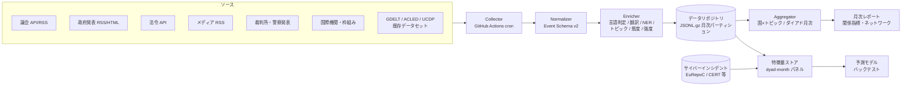

# 世界政治・軍事・紛争インテリジェンス 収集・分析プラン

- 版: v1.0 (ドラフト)
- 作成日: 2026-08-21
- 対象リポジトリ: `proshiba/political-intel-analysis`
- 目的: 世界各国の政治・軍事・紛争関連の出来事を継続的に収集・正規化し、(1) ローデータの蓄積、(2) トピック別の各国態度分析、(3) 月次の国家間関係分析を GitHub 上で運用する。最終的にサイバー攻撃傾向予測の特徴量として利用する。

---

## 0. TL;DR — 推奨アプローチ

1. **「全世界を自前クロール」はしない。** 全世界のメディア・イベントは GDELT 等の既存アグリゲータで底面カバレッジを確保し、自前収集は優先国 (Tier 1 → 2) の一次ソース (議会 API・政府 RSS・法令 API 等) に集中する。これで初月から約 200 カ国をカバーしつつ、重点国は一次情報で深掘りできる。
2. **HTML スクレイピングより API / RSS / オープンデータを優先する。** congress.gov の 403 (README の試行記録) が示す通り、主要国ほど anti-bot が強い一方、公式 API が整備されている。既存クローラーは「API も RSS もない補完ソース」用に残す。
3. **共通イベントスキーマ (Event v2) に正規化してから分析する。** 現行 `IntelRecord` を拡張し、行為主体 (actor)・対象 (target)・トピック・態度 (stance)・強度 (intensity) を持たせる。国家間関係の月次集計はこのスキーマから機械的に導出する。
4. **GitHub には「選別・正規化済みデータと派生物」を置き、生 HTML やメディア全文は置かない。** 著作権・容量の両面の制約による。データはコードと分離したデータリポジトリに月次パーティションの JSONL.gz / Parquet で保存する。
5. **LLM エンリッチメントは 2 段構え + Batch API。** 大量の一次分類は Haiku、態度・関係分析は Sonnet/Opus、いずれも非リアルタイムなので Batch API (50% off) で回す。
6. **サイバー予測は「ダイアド (国ペア) × 月」の傾向予測に絞る。** 個別攻撃の予測は不可能。公表遅延によるリークを避ける設計 (as-of スナップショット) を最初から入れる。

---

## 1. 目的と成果物

### 1.1 プロダクトとしての成果物

| # | 成果物 | 形式 | 更新頻度 |
|---|--------|------|----------|
| P1 | ローデータ (正規化済みイベント) | JSONL.gz (月次パーティション) | 日次 |
| P2 | 国×トピック 態度マトリクス | Parquet / CSV + Markdown レポート | 月次 |
| P3 | 国家間関係指標 (ダイアド指数・ネットワーク) | Parquet / CSV + Markdown レポート + 図 | 月次 |
| P4 | 国際枠組みデータ (加盟・声明・投票) | YAML / CSV | 随時 |
| P5 | サイバー予測用特徴量ストア | Parquet (dyad-month パネル) | 月次 |
| P6 | ソース健全性レポート | Markdown | 週次 |

### 1.2 成功基準 (12 ヶ月後)

- カバレッジ: 190+ カ国についてメディア由来イベントが月次で存在し、Tier 1 (約 18 カ国・機関) は議会・政府・法令の一次ソースを日次収集している。
- 品質: イベントの国・トピック分類の抜き取り検査で精度 85% 以上。重複率 5% 未満。
- 分析: 月次関係レポートが毎月 5 営業日以内に自動生成される。
- 予測: dyad-month パネルでのバックテストが、単純ベースライン (前月踏襲) を有意に上回る。

---

## 2. 現状とギャップ

### 2.1 現状 (このリポジトリにあるもの)

- `political_intel.crawler`: robots.txt 遵守・ドメイン別レート制限付きの同一ドメインクローラー (httpx / Selenium)。
- `political_intel.extractor`: trafilatura ベースの本文抽出 + キーワード・シグナル検出。
- `political_intel.analyzer`: 国別のシグナル集計と簡易インサイト (Markdown 出力)。
- `data/sources.example.json`: 3 ソースのサンプル設定。

### 2.2 ギャップ (本プランで埋めるもの)

| 領域 | 現状 | 目標 |
|------|------|------|
| カバレッジ | サンプル 3 ソース | 全世界 (アグリゲータ) + Tier 1/2 一次ソース |
| 収集方式 | HTML クロールのみ | API / RSS / バルクデータセット取込を主軸に追加 |
| スキーマ | `IntelRecord` (国・シグナル・キーワード) | Event v2 (actor / target / topic / stance / intensity) |
| 分析 | 国別キーワード集計 | トピック×態度、月次ダイアド関係、ネットワーク分析 |
| 多言語 | 実質英語のみ | 言語判定 + 要約翻訳 (LLM) で言語非依存化 |
| 実行 | 手動 CLI | GitHub Actions cron による無人運用 |
| データ保存 | 出力ディレクトリ (コミット対象外) | データリポジトリへの月次パーティション保存 |
| サイバー接続 | なし | インシデントデータセットとの結合 + 予測パネル |

---

## 3. 全体アーキテクチャ



処理は 5 層に分ける。各層は独立に再実行可能 (冪等) にする。

1. **Collect**: ソースから取得し、取得時メタデータ付きでランディング領域に保存。
2. **Normalize**: Event v2 スキーマへ変換。重複排除。ここまでは決定的処理。
3. **Enrich**: LLM / NLP による付加 (翻訳・NER・トピック・態度・強度)。プロンプトとモデルのバージョンを記録し、再現可能にする。
4. **Aggregate**: 月次で国×トピック、ダイアド (国ペア) 指標に集計。
5. **Analyze / Predict**: レポート生成、特徴量化、モデル学習・バックテスト。

---

## 4. 対象範囲 — 国のティアリングと国際枠組み

「できる限り世界中」を現実にするため、収集の深さを 3 段階に分ける。**どの国もカバレッジゼロにはしない** (Tier 3 でもアグリゲータ経由でイベントは入る)。

### 4.1 国のティアリング

| Tier | 対象 (目安) | 収集する層 | 更新 |
|------|-------------|------------|------|
| **Tier 1** (~18) | 米・中・露・日・韓・台・英・独・仏・EU・ウクライナ・イスラエル・イラン・インド・ポーランド・豪・加・北朝鮮(公式発表のみ) | 議会・政府・法令・裁判所・警察・主要メディアの一次ソース | 日次 (一部 6h) |
| **Tier 2** (~40) | G20 残り + 地域大国 (ブラジル・トルコ・サウジ・インドネシア・ナイジェリア・エジプト・南ア・メキシコ 等) + 紛争当事国 | 政府発表 RSS + 議会 (API がある国) + アグリゲータ | 日次 |
| **Tier 3** (残り ~140) | その他すべて | GDELT 等アグリゲータ + 国際機関文書 + 重大時のスポット収集 | 日次 (アグリゲータ経由) |

- Tier 選定基準: サイバー活動との関連性 (攻撃主体・被害国)、軍事・外交上の重要度、進行中紛争、ユーザーの関心 (日本の安全保障環境)。
- Tier は `sources/registry/` の国別ファイルの属性として管理し、昇降格できるようにする。紛争が発生した国は一時的に Tier を上げる運用 (サージ収集)。

### 4.2 国際枠組み

枠組みは「準アクター」としてイベントスキーマ上で国と同格に扱う (actor に `org` として登場)。加えて **加盟・参加のマスタデータ**を独立に持つ。

| 分類 | 対象例 | 収集物 |
|------|--------|--------|
| 国連系 | 国連総会・安保理、専門機関 | 決議文、投票記録 (賛否棄権)、議長声明、報道発表 |
| 安全保障 | NATO, CSTO, AUKUS, Quad, 五眼 | 首脳・外相声明、共同宣言、演習発表、加盟変動 |
| 地域機構 | EU, ASEAN, AU, OAS, OSCE, GCC, SCO | 声明、制裁決定、議長総括 |
| 経済・その他 | G7, G20, BRICS, OIC | 首脳宣言、閣僚声明、参加国リスト |

- マスタデータ: `frameworks/membership.csv` (framework, country, status, from, to, source_url)。加盟・脱退・停止はイベントとしても記録する (関係分析の強いシグナル)。
- 投票記録 (特に国連総会) は既存データセット (付録 B) で過去分を取り込み、新規分を追記する。

---

## 5. ソース戦略 (種別ごと)

原則: **(1) バルクデータセット → (2) 公式 API → (3) RSS/サイトマップ → (4) HTML クロール (既存クローラー) → (5) Selenium** の優先順で、上位の手段があるソースに下位の手段を使わない。

### 5.1 議会 (議事録・審議)

- 公式 API がある国から着手する: 日本 (国会会議録検索システム API)、米 (congress.gov API / GovInfo)、英 (Hansard API)、独 (Bundestag DIP API)、EU 議会 (Open Data Portal)、韓国 (国会 Open API)、仏 (Assemblée nationale open data) など。
- 過去分のバックフィルは研究用コーパス (ParlaMint = 欧州二十数カ国の議会コーパス、ParlSpeech) を利用。
- 議事録は長大なので、全文は保存せず「発言単位に分割 → 政治・軍事・外交・サイバー関連の発言のみ抽出してイベント化」する。抽出フィルタはキーワード + 安価な LLM 分類の 2 段。

### 5.2 政府発表 (行政府・外務・国防)

- 各国の首脳府・外務省・国防省の報道発表 RSS を中心に登録する (例: 首相官邸・外務省・防衛省、White House / State / DoD、Downing St / FCDO、Élysée、kremlin.ru、中国外交部 等)。
- 多くの政府サイトは英語版を持つ。原語版 + 英語版の両方を登録し、重複は正規化層で排除する。
- 制裁 (財務省系: OFAC、EU 制裁リスト、日本の外為法告示) は関係分析の強シグナルなので専用コレクタを立てる。

### 5.3 法案・法律

- 法令 API: e-Gov 法令 API (日)、congress.gov (米)、EUR-Lex Web サービス (EU)、legislation.gov.uk (英) など。
- 全文ではなく「法案の提出・可決・施行」をイベントとして扱い、安全保障・サイバー・防衛・輸出管理関連のみ本文参照を保存する。

### 5.4 メディア

- **底面カバレッジは GDELT** (全世界・100+ 言語・15 分更新、CAMEO イベントコード + Goldstein 強度 + トーンが付与済み)。GDELT 2.0 Events / GKG を日次で取り込み、政治・軍事・外交関連のイベントコードでフィルタして保存する。過去分のバックフィルは BigQuery 公開データセットが効率的。
- 補完として Tier 1 諸国の主要メディア RSS (公共放送・通信社優先: NHK, Reuters, AP, AFP, BBC 等) を登録する。
- **著作権対応**: メディア記事の全文は保存しない。保存するのは URL・見出し・発行日時・自動生成の短い要約・分類結果のみ (§11)。
- 国営・国家系メディア (新華社、RT、KCNA、TASS 等) は `state_affiliated: true` をソース属性に付与し、分析時に「政府の意思表示」として扱えるようにする (プロパガンダをノイズではなく態度シグナルとして使う)。

### 5.5 裁判所

- 対象: 国際司法裁判所 (ICJ)、国際刑事裁判所 (ICC)、欧州人権裁判所、主要国の最高裁・憲法裁。
- 収集するのは判決・命令の発表 (メタデータ + 要旨)。国家間紛争 (ICJ 提訴等) とサイバー犯罪訴追 (起訴状) を重点タグにする。

### 5.6 警察・治安・情報機関

- サイバー予測に最も直結する層。各国警察 (FBI/DOJ, Europol, NCA, BKA, 警察庁・公安調査庁)、および **CERT/CSIRT (JPCERT/CC, CISA, NCSC-UK, ANSSI, BSI 等) の注意喚起**を収集する。
- 摘発・起訴・テイクダウン・帰属公表 (attribution) は「国家間サイバー関係イベント」としてイベント化する。

### 5.7 既存データセットの取り込み

自前収集と同じスキーマに正規化して使う。**再配布可否がデータセットごとに違う**点に注意 (付録 B に整理)。再配布不可のもの (ACLED 等) は、GitHub には派生集計値のみを置き、ローデータは置かない。

---

## 6. データ設計

### 6.1 Event スキーマ v2

現行 `IntelRecord` の後継。1 レコード = 1 出来事 (または 1 文書)。

```jsonc
{
  "event_id": "evt_20260815_jp-mofa_8f3ac2",     // 決定的に生成 (source_id + url hash)
  "schema_version": "2.0",
  "collected_at": "2026-08-15T09:12:44Z",
  "published_at": "2026-08-15T06:00:00Z",
  "source": {
    "id": "jp-mofa-press",
    "type": "government",                          // parliament|government|law|media|judiciary|police|igo|dataset
    "name": "外務省 報道発表",
    "country": "JP",                               // ISO 3166-1 alpha-2 ("--" = 国際機関)
    "url": "https://www.mofa.go.jp/mofaj/press/...",
    "access_method": "rss",
    "license": "jp-gov-standard-terms",
    "state_affiliated": true
  },
  "language": "ja",
  "title": "○○に対する制裁措置について(外務大臣談話)",
  "summary_native": "…(原語の短い要約)",
  "summary_en": "…(英語要約。分析はこちらを共通言語に)",
  "full_text_included": false,                     // 本文保存はライセンス許容時のみ
  "actors":  [{ "country": "JP", "org": "MOFA", "role": "author" }],
  "targets": [{ "country": "RU" }],
  "topics": ["sanctions", "diplomacy"],            // 固定タクソノミ (§7.3)
  "event_type": "SANCTION",                        // PLOVER/CAMEO 準拠のイベント型
  "intensity": -5.6,                               // Goldstein 尺度 [-10, +10]
  "stances": [
    { "holder": "JP", "toward": "RU", "score": -0.8, "confidence": 0.9,
      "evidence": "「断じて容認できない」" }
  ],
  "geo": { "mentioned": ["UA"] },
  "dedup": { "url_hash": "…", "simhash": "…" },
  "enrichment": { "model": "claude-haiku-4-5", "prompt_version": "cls-v3", "enriched_at": "…" }
}
```

設計上のポイント:

- `event_id` は入力から決定的に生成し、再実行しても同じ ID になるようにする (冪等性)。
- `stances` は「誰が・誰/何に・どのくらい肯定/否定か」を [-1, +1] で持ち、必ず根拠引用 (`evidence`) を付ける。トピック分析 (P2) と関係分析 (P3) の両方の原料になる。
- `intensity` は国際関係研究で標準的な Goldstein 尺度 (協調 +10 〜 敵対 -10) に合わせ、GDELT 由来イベントとネイティブ収集イベントを同じ軸で集計できるようにする。
- enrichment のモデル・プロンプト版を必ず記録し、後からの再エンリッチ (プロンプト改善時) を差分実行できるようにする。

### 6.2 ソースレジストリ

現行 `data/sources.example.json` を、国別 YAML のレジストリに発展させる。国が約 200 になってもファイル分割で管理できる。

```yaml
# sources/registry/jp.yaml
country: JP
tier: 1
sources:
  - id: jp-kokkai-api
    branch: parliament
    name: 国会会議録検索システム
    access: api
    endpoint: https://kokkai.ndl.go.jp/api/
    cadence: daily
    license: ndl-api-terms
  - id: jp-mofa-press
    branch: government
    access: rss
    endpoint: https://www.mofa.go.jp/mofaj/press/release/rss.xml
    cadence: 6h
  - id: jp-egov-law
    branch: law
    access: api
  - id: jp-npa
    branch: police
    access: html          # API/RSS がないため既存クローラーで
    cadence: daily
  - id: jp-nhk-politics
    branch: media
    access: rss
    full_text_policy: metadata-only
```

### 6.3 GitHub 上のリポジトリ・レイアウト

GitHub の制約 (1 ファイル 100MB 上限・50MB 警告、リポジトリは 1〜5GB 推奨、LFS は無料枠が小さい) を踏まえ、**コードとデータを分離**し、データは年次でシャードする。

| リポジトリ | 内容 | 目安サイズ |
|-----------|------|-----------|
| `political-intel-analysis` (本リポ) | コード、スキーマ、ソースレジストリ、docs、月次レポート (md + 図)、集計値 (Parquet/CSV) | < 1GB |
| `political-intel-data-2026` (年次シャード) | 正規化・エンリッチ済みイベント JSONL.gz。`events/YYYY-MM/{tier1|gdelt|igo}/…` | 年 2〜5GB |
| (任意) `political-intel-raw-cache` | ライセンス上保存可能な公文書全文のみ。private 推奨 | 必要に応じ |

- パーティション: `events/2026-08/jp/part-000.jsonl.gz` のように 月×国 (または月×ソース群) で分割し、1 ファイルを 50MB 未満に保つ。
- 月次スナップショット: 各月確定後、集計値と checksum を GitHub Releases に添付 (1 アセット 2GB まで)。データ修正はスナップショットの再発行で表現し、履歴を残す。
- 容量見積り: GDELT を政治・軍事関連にフィルタして 1 日 2〜5 万イベント → メタデータ中心なら圧縮後 月 100〜300MB 程度。Tier 1 一次ソースは月 1〜3 万文書 → 月 50MB 前後。年間シャード 2〜4GB に収まる想定。あふれる場合は「Tier 3 の低強度イベントは日次集計値に丸める」ことで制御する。

---

## 7. 処理パイプライン (正規化〜エンリッチメント)

### 7.1 正規化・重複排除

- URL 正規化 + `url_hash`、本文 simhash による near-duplicate 検出 (同一発表の多言語版・転載をクラスタ化し、代表 1 件 + `duplicates: [...]` で保持)。
- 発行日時の抽出は既存 extractor を拡張 (メタタグ → 構造化データ → 本文パターンの順)。

### 7.2 言語処理

- 言語判定 (fastText / lingua 等の軽量ライブラリ)。
- 分析の共通言語は英語とする。**全文翻訳はしない**。LLM に「原文 → 英語要約 (3〜5 文) + 分類」を一括で行わせ、翻訳コストを分類コストに吸収させる。原語要約も保持し、日本語レポート生成時は原語/英語要約から生成する。

### 7.3 トピック・タクソノミ (固定)

第 1 階層は固定 15 分類程度に抑え、モデル間・時期間の一貫性を優先する。

```
military_operation / military_posture(演習・配備) / diplomacy / sanctions /
alliance_framework / territorial_dispute / domestic_politics / election /
protest_unrest / terrorism / law_enforcement / judiciary / cyber /
trade_economy / energy_resources / information_influence(宣伝・偽情報)
```

- `cyber` はさらに副分類 (attribution 公表 / 摘発 / 能力・政策 / インシデント言及) を持たせる。予測タスクの直接シグナルになる。

### 7.4 LLM エンリッチメント (2 段構え)

| 段 | 対象 | モデル | 処理 |
|----|------|--------|------|
| 一次 | 全収集文書 (タイトル + 冒頭) | Claude Haiku 4.5 | 関連性フィルタ、トピック分類、actor/target 抽出、英語要約 |
| 二次 | 一次で「態度・関係シグナルあり」と判定された文書 (~2 割) | Claude Sonnet 5 (または Opus 5) | stance 抽出 (根拠付き)、intensity 推定、イベント型 (PLOVER) 付与 |
| 月次 | 集計結果 | Claude Opus 5 | 月次レポートの解説文生成、変化点の要約 |

- 実行は **Message Batches API** (非同期・50% 割引) を基本にする。日次バッチで十分。
- プロンプトは `prompts/` にバージョン管理し、固定部分を先頭に置いて prompt caching を効かせる。
- 構造化出力 (`output_config.format`) で JSON スキーマを強制し、パース失敗をなくす。
- 品質管理: 月 200 件を層化サンプリングして人手検査 (または上位モデルによる審査) し、精度をレポートに記録する。

---

## 8. 分析設計

### 8.1 トピック分析 — 国×トピック 態度マトリクス (P2)

- 集計単位: 国 × トピック (× 対象国/枠組み) × 月。
- 指標: 言及量 (イベント数)、平均 stance、stance の分散 (国内の割れ)、前月比 Δ。
- 出力例: 「ウクライナ支援」トピックに対する各国 stance の月次推移、「対中制裁」への G7 内の温度差、等。
- 可視化: ヒートマップ (国×トピック)、時系列小図。レポートは Markdown + SVG/PNG で `reports/monthly/YYYY-MM/topics.md` に自動生成。

### 8.2 月次 国家間関係分析 (P3)

**ダイアド指数**: 有向国ペア (A→B) ごとに月次で合成指数を計算する。

| 成分 | 内容 | 重み (初期値) |
|------|------|---------------|
| `coop_conflict` | A→B イベントの intensity (Goldstein) の加重平均 | 0.4 |
| `stance` | A の政府・国営ソースにおける対 B stance 平均 | 0.3 |
| `markers` | 離散イベント: 制裁発動 (-), 首脳会談 (+), 合同演習 (+/相手向けなら -), 大使召還 (-), 条約署名 (+), 断交 (-) など固定重み表 | 0.2 |
| `volume` | 言及量の対数 (関係の顕在度。符号は他成分に従属) | 0.1 |

- 合成指数は [-10, +10] に正規化し、イベント件数が少ないダイアドは信頼区間を広く付す (少数イベントでの過剰反応を防ぐ)。
- **ネットワーク分析**: 月次の関係グラフから、コミュニティ検出 (陣営構造)、中心性、構造的変化 (前月比で最も動いたダイアド Top N) を算出。国連投票の理想点データ (付録 B) と突き合わせて指数の妥当性を検証する。
- **変化検知**: ダイアド指数・トピック言及量の z-score による急変検出。急変ダイアドは月次レポートの冒頭に「エスカレーション・ウォッチ」として列挙する。
- 出力: `relations/2026-08/dyads.parquet`, `reports/monthly/2026-08/relations.md` (自動生成: サマリ、急変、ネットワーク図、主要ダイアド詳細)。

### 8.3 枠組み分析

- 加盟マスタ (§4.2) から国ペアの「共同加盟距離」を特徴量化 (同盟内/敵対枠組み間)。
- 共同声明は署名国全ペアに弱い協調イベントとして展開する (N 国声明 → nC2 ダイアドに配分)。

---

## 9. サイバー攻撃傾向予測への接続

### 9.1 予測タスクの定義 (現実的な粒度)

個別攻撃の予測は不可能。**「どの国ペア/どの国で、翌月に公表されるサイバー活動が増えるか」**という傾向予測に絞る。

| タスク | 目的変数 | ラベル源 |
|--------|----------|----------|
| T1: ダイアド攻撃活動 | dyad(A→B) の翌月公表インシデント数の増減区分 | EuRepoC, CFR Cyber Operations Tracker |
| T2: ハクティビズム発生 | 国 B に対するハクティビスト・キャンペーン発生有無 (翌 2〜4 週) | 公開レポート、CERT 注意喚起 (速報性が高い) |
| T3: 種別別傾向 | 国別の DDoS / defacement / wiper / espionage 言及量 | CERT/ベンダーレポート、`cyber` トピックの自データ |

### 9.2 リーク (未来情報混入) 対策 — 最重要の設計制約

- 国家系インシデントの帰属公表は発生から数ヶ月〜数年遅れる。**学習時は「時点 T までに公表されていた情報のみ」で特徴量とラベルを構成する** (as-of スナップショット)。インシデントデータは `occurred_at` と `disclosed_at` を分離して保存し、バックテストでは `disclosed_at <= T` でフィルタする。
- 月次で特徴量ストア (P5) を凍結してコミットする運用にすれば、GitHub の履歴自体が as-of スナップショットの証跡になる (この点で「全部 GitHub に載せる」方針は予測研究と相性が良い)。

### 9.3 特徴量設計 (dyad-month パネル)

- 関係指数の水準と変化 (t-1〜t-6 のラグ、Δ、急変フラグ)
- トピック別シグナル: 制裁発動、軍事演習、領土問題言及、attribution 公表、首脳会談決裂 等
- カレンダー: 選挙 (前後 30 日)、国家記念日、国際会議 (サミット開催国)
- 枠組み特徴: 共同加盟距離、陣営間ダイアドか
- 自己回帰項: 当該ダイアドの過去インシデント数 (ベースライン能力・意図の代理)
- 能力の代理変数: 攻撃側 A の既知 APT 活動量、ハクティビスト動員力

### 9.4 モデリングと評価

1. ベースライン: 前月踏襲 (persistence)・季節平均。**これに勝てない特徴量は捨てる**。
2. 本命: dyad-month パネルへの勾配ブースティング (LightGBM) による分類 (増加/非増加)、および負の二項回帰による件数モデル。SHAP で寄与を解釈する。
3. 評価: rolling-origin バックテスト (12 ヶ月以上)、クラス不均衡のため PR-AUC / Brier score。国・ダイアドごとの層別評価。
4. 妥当性検証 (イベントスタディ): 既知事例で挙動を確認する — 2022 ウクライナ侵攻前後の wiper/DDoS 波、2022-08 ペロシ訪台時の対台湾 DDoS、2022-09 Killnet の対日 DDoS、大規模制裁発表後のハクティビズム等。
5. **限界の明記**: 公開データは「公表された活動」しか捉えない (検知・公表バイアス)。espionage は平時も定常的に発生し地政学イベントとの相関が弱い一方、DDoS/defacement/wiper は緊張に即応する — タスクを種別で分けるのはこのため。予測は確率的な傾向情報であり、個別防御の根拠は別途の技術的インテリジェンスと併用する。

---

## 10. GitHub 運用設計

### 10.1 GitHub Actions ワークフロー

| ワークフロー | cron (目安) | 内容 |
|--------------|-------------|------|
| `collect-tier1.yml` | 6 時間ごと | Tier 1 一次ソース (API/RSS) の収集 → 正規化 → data repo へ push |
| `collect-gdelt.yml` | 日次 | GDELT 差分取込 → フィルタ → 正規化 |
| `enrich.yml` | 日次 (collect 後) | Batch API 投入 → 結果回収 → イベント更新 |
| `aggregate-monthly.yml` | 毎月 1 日 | 前月分の集計・レポート・特徴量ストア生成 |
| `source-health.yml` | 週次 | 全ソースの死活・件数推移 → `reports/source-health.md` |

運用上の注意:

- public リポジトリの scheduled workflow は **60 日間リポジトリに活動がないと自動停止**する。日次コミットがあるので実質問題にならないが、keepalive を意識しておく。
- cron は保証実行ではない (遅延・スキップあり)。収集は常に「前回位置からの差分」方式にし、1 回落ちても次で回復するようにする。
- API キー (congress.gov, Anthropic 等) は GitHub Secrets。データ repo への push は fine-grained PAT または GitHub App トークンで行う。
- 並列化はソース単位の matrix で行い、同一ドメインへの並列アクセスは避ける (既存のドメイン別スロットリングを維持)。

### 10.2 品質管理 CI

- スキーマ検証: JSON Schema で全イベントを検証 (`jsonschema` を requirements に追加)。不合格は隔離ディレクトリへ。
- pytest: 既存テストを維持しつつ、正規化・集計ロジックの回帰テストを追加。
- メトリクス: 収集件数・重複率・enrichment 失敗率・国別カバレッジを週次レポートに出力。
- スキーマは semver 管理 (`schema_version` フィールド)。破壊的変更時は変換スクリプトを同梱する。

---

## 11. 法務・倫理・コンプライアンス

このプロジェクトは公開情報 (OSINT) のみを扱うが、「収集して公開リポジトリに再掲する」行為には別途の制約がかかる。

1. **アクセス面**: robots.txt・利用規約の遵守、ドメイン別レート制限、連絡先入り User-Agent (既存実装を維持)。anti-bot を回避する技術的迂回はしない — 拒否されたソースは公式 API・代替ソースに切り替える (congress.gov の 403 対応と同方針)。
2. **著作権**:
   - 報道記事: 全文の再掲は不可。保存・公開するのは URL、見出し、発行日、**自動生成の短い要約**、分類メタデータまで。
   - 政府文書: 国により扱いが異なる (米連邦政府文書はパブリックドメイン、日本は政府標準利用規約、英は Open Government Licence、等)。ソースレジストリの `license` フィールドに記録し、全文保存はライセンスが許すソースに限る。
   - 外部データセット: 再配布可否を確認して従う (付録 B)。再配布不可のものは派生集計値のみを公開する。
3. **個人情報**: 警察・裁判所ソースには私人の氏名が含まれ得る。方針: 公人 (政府高官・議員・被起訴の国家アクター) 以外の個人名はイベント化の際に保持しない。要約にも含めない。GDPR 的な削除要請に応じられるよう、イベント単位で削除可能な構造にする。
4. **偽情報・宣伝**: 国営メディアは排除せず `state_affiliated` タグで区別する (§5.4)。事実性の判定はせず、「その国がそう主張した」というイベントとして扱う。
5. **ライセンス**: 自作データセットには明示的ライセンス (CC BY 4.0 推奨) + ソースごとの出所・ライセンス一覧 (`ATTRIBUTION.md`) を付ける。
6. **利用目的**: 本データの用途は防御的なサイバー脅威予測・情勢分析であり、攻撃対象選定等への転用を意図しない旨を README に明記する。

---

## 12. 実装ロードマップ

| Phase | 期間 (目安) | 内容 | Done の定義 |
|-------|-------------|------|-------------|
| **0: 基盤** | 2〜3 週 | Event v2 スキーマ確定・JSON Schema 化 / ソースレジストリ形式確定 + 日米 EU 国連の登録 / GDELT 日次取込 / データ repo (`-data-2026`) 作成 / Actions で collect が無人で回る | 10 日連続で日次収集が自動成功し、イベントがスキーマ検証を通過して data repo に蓄積される |
| **1: エンリッチ & Tier 1** | 1〜2 ヶ月 | Haiku 一次分類 + Sonnet 態度抽出 (Batch API) / Tier 1 一次ソース (議会 API・政府 RSS・CERT) を順次追加 / 品質サンプリング開始 | Tier 1 の 18 主体で議会 or 政府ソースが稼働し、態度付きイベントが日次生成、分類精度 80%+ |
| **2: 分析定常化** | 2〜3 ヶ月 | 国×トピック マトリクス / ダイアド指数 + ネットワーク / 月次レポート自動生成 / 国連投票・枠組みマスタ統合 / Tier 2 拡大 | 月次レポート (topics.md, relations.md) が毎月自動生成され、既知の関係変化 (検証事例) を再現できる |
| **3: サイバー統合** | 3〜6 ヶ月 | インシデントデータ統合 (as-of 構造) / dyad-month 特徴量ストア / ベースライン→GBDT バックテスト / 予測レポート試行 | 12 ヶ月 rolling バックテストで persistence ベースラインを上回り、月次で予測メモが出せる |

- Phase 0 の最初の一歩: 既存 `political_intel` に `collectors/` (rss, gdelt, api 基底クラス) と `schema/event_v2.json` を追加するところから始める。既存クローラーは `access: html` ソース用コレクタとしてそのまま組み込む。

---

## 13. コスト概算 (月次・定常運用時)

前提: 月 5 万イベントを一次分類、うち 1 万件を二次 (態度) 分析。Batch API (50% off) 使用。

| 項目 | 概算 | 根拠 |
|------|------|------|
| LLM 一次分類 (Haiku 4.5) | ~$60/月 | 5 万件 × (入力 1.5k + 出力 0.2k tokens)、$1/$5 per MTok の半額 |
| LLM 二次分析 (Sonnet 5) | ~$70/月 | 1 万件 × (入力 2k + 出力 0.5k tokens)、$3/$15 per MTok の半額 |
| LLM 月次レポート (Opus 5) | ~$15/月 | 数十レポート × 長文入力 | 
| GitHub Actions | $0 | public リポジトリは standard runner 無料 |
| ストレージ | $0 | GitHub 内 (シャーディングで制限内に収める) |
| 外部 API | $0〜 | 政府系 API はほぼ無料。BigQuery (GDELT バックフィル) はスキャン量課金に注意 |

**合計: 月 $150 前後** (規模 2 倍でもほぼ線形)。プロンプトキャッシュ (固定指示部) でさらに 2〜3 割下げられる。まず Phase 0〜1 は月 $50 以下で始まる。

---

## 14. リスクと対策

| リスク | 影響 | 対策 |
|--------|------|------|
| ソースのブロック・仕様変更 | 収集欠損 | API/RSS 優先、週次ヘルスレポートで早期検知、ソース多重化 (同じ事実を政府+通信社で拾う) |
| 言語カバレッジの偏り (英語偏重) | 非西側の態度を過小評価 | GDELT の多言語イベント + 原語要約保持、Tier 1 に非英語圏を明示的に含める |
| 公表バイアス (サイバーラベル) | 予測の系統誤差 | 種別分割 (§9.4)、複数ラベル源の突合、限界の明記 |
| LLM 分類のドリフト | 時系列の断絶 | プロンプト/モデルの版管理、月次の固定ベンチマークセットで回帰確認 |
| データ容量の増大 | GitHub 制限超過 | 年次シャード、低強度イベントの集計丸め、メタデータ中心の保存方針 |
| 地政学的に敏感な国のサイト (アクセス不能・改竄) | 欠損・汚染 | ミラー/アーカイブの併用、ソース信頼度メタデータ、取得時ハッシュ記録 |
| 個人情報・著作権の見落とし | 法的リスク | §11 の方針を正規化層でコード化 (自動マスキング・全文保存フラグのデフォルト off) |

---

## 付録 A: Tier 1 一次ソース候補 (初期登録リスト)

| 国/主体 | 議会 | 政府 | 法令 | 警察/CERT |
|---------|------|------|------|-----------|
| 日本 | 国会会議録検索 API | 官邸・外務省・防衛省 RSS | e-Gov 法令 API | 警察庁 / NISC / JPCERT-CC |
| 米国 | congress.gov API, GovInfo | White House / State / DoD | congress.gov, Federal Register API | FBI・DOJ / CISA |
| EU | 欧州議会 Open Data | 欧州委員会・EEAS | EUR-Lex Web サービス | Europol / ENISA |
| 英国 | Hansard API | gov.uk (No.10, FCDO, MoD) | legislation.gov.uk API | NCA / NCSC-UK |
| ドイツ | Bundestag DIP API | 連邦政府・外務省 | Gesetze im Internet | BKA / BSI |
| フランス | AN open data | Élysée・外務省 | Légifrance | ANSSI |
| 中国 | 全人代 (公報) | 国務院・外交部 (英語版あり) | 官報 | 公安部 / CNCERT |
| ロシア | Duma (公報) | kremlin.ru・外務省 | 官報 | (公式発表のみ) |
| 韓国 | 国会 Open API | 大統領室・外交部 | 国家法令情報 | 警察庁 / KISA |
| 台湾 | 立法院 | 総統府・外交部・国防部 | 全国法規 DB | 刑事局 / TWCERT |
| ウクライナ | Rada | 大統領府・外務省 | Rada 法令 DB | CERT-UA |
| その他 | インド・イスラエル・イラン・ポーランド・豪・加・北朝鮮 (KCNA 等公式発表のみ) を同様に整備 | | | |

注: ロシア・中国・イラン・北朝鮮系はアクセス制限・接続性の変動があるため、取得可否をヘルスレポートで監視し、国際報道 (GDELT) で補完する。

## 付録 B: 活用する既存データセット

| データセット | 内容 | GitHub への再配布 |
|--------------|------|-------------------|
| GDELT 2.0 (Events/GKG) | 全世界メディアのイベント抽出 (CAMEO/Goldstein/トーン付き)、15 分更新 | 可 (出典明記)。フィルタ済み派生を保存 |
| UCDP GED | 武力紛争イベント (研究標準) | 可 (出典明記) |
| ACLED | 紛争・抗議イベント (要登録) | **ローデータ再配布不可** → 派生集計のみ |
| 国連総会投票 (Voeten et al.) | 投票記録 + 理想点推定 | 可 (出典明記) |
| ParlaMint / ParlSpeech | 欧州等の議会議事録コーパス | ライセンス確認の上、抽出イベントのみ保存 |
| V-Dem | 政治体制指標 (年次) | 可 (出典明記)。国属性の共変量に |
| EuRepoC | サイバーインシデント (国家帰属・ダイアド付き) | 要ライセンス確認 (CC 系)。予測ラベルの主軸 |
| CFR Cyber Operations Tracker | 国家系サイバー作戦 | Web 公開。抽出・出典明記で派生保存 |
| CISA KEV / 各国 CERT 注意喚起 | 悪用脆弱性・キャンペーン速報 | 米政府文書は PD。ラベル/特徴量に |
| OFAC / EU / 国連制裁リスト | 制裁対象 | 可。`markers` 成分の一次源 |

---

*本プランは v1.0 ドラフト。Phase 0 着手時に、スキーマ (§6.1) とソースレジストリ形式 (§6.2) を実装しながら確定させる。*
